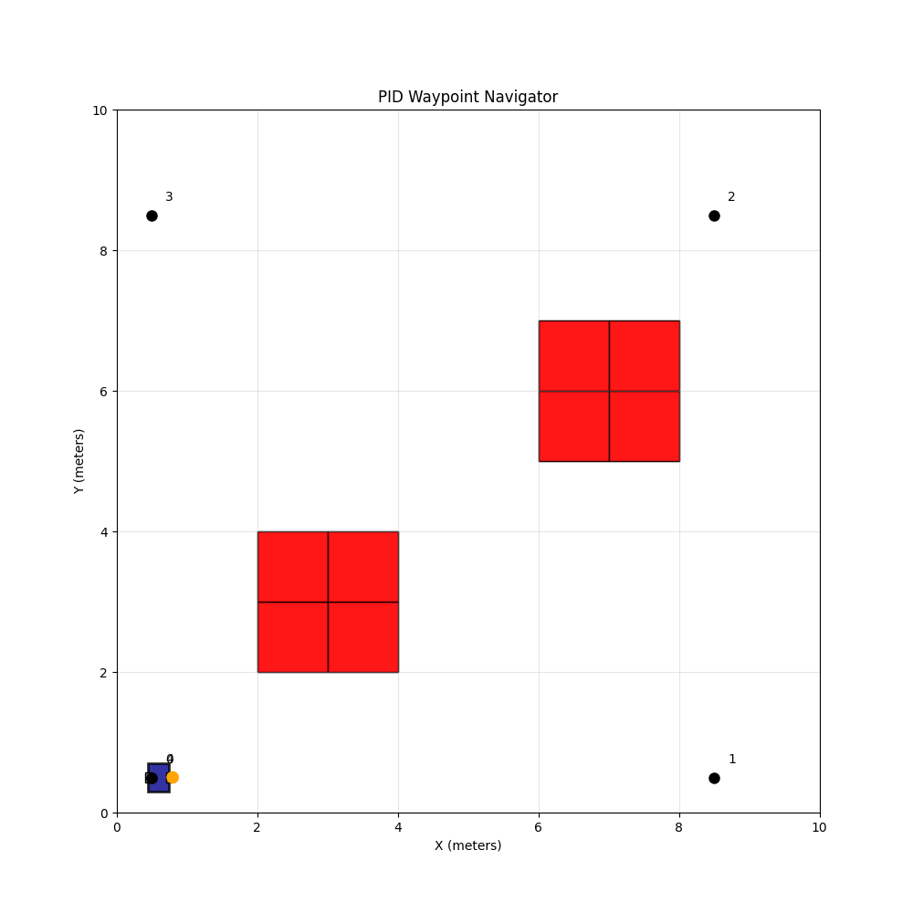
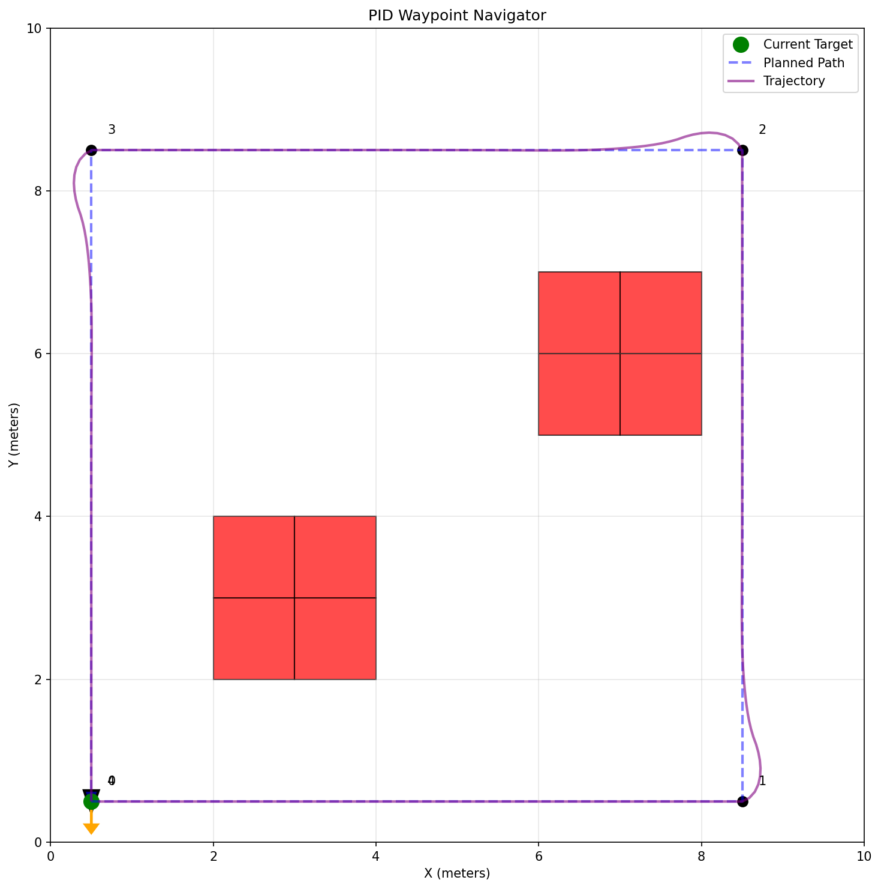

# Multi-Waypoint Follower Robot

A Python-based 2D mobile robot navigation simulator demonstrating PID control theory applied to waypoint following with A* pathfinding algorithm.



## 🎯 Goal

Implement a complete autonomous navigation system for a differential-drive mobile robot that:
- Plans optimal collision-free paths using A* algorithm
- Follows paths using dual PID controllers (heading + velocity)
- Navigates through multiple waypoints sequentially
- Avoids static obstacles in real-time

## 🛠️ Technologies

- **Python 3.10+** - Core programming language
- **NumPy** - Numerical computations and kinematics
- **Matplotlib** - Visualization and animation
- **A\* Algorithm** - Optimal pathfinding with Euclidean heuristic
- **PID Control** - Dual feedback control (heading + velocity)

## 📁 Project Structure
```
pid-waypoint-navigator/
├── src/
│   ├── core/              # Robot kinematics, PID controller, Waypoint management
│   ├── planning/          # A* pathfinding algorithm
│   ├── control/           # Path following with PID control
│   ├── simulation/        # Simulator orchestration and visualization
│   └── main.py            # Main entry point
├── tests/                 # Unit tests (24 tests, all passing)
├── Dockerfile             # Container configuration
├── requirements.txt       # Python dependencies
├── .gitignore            # Git ignore rules
└── README.md             # This file
```

## 🚀 Launch

### 1. Install Dependencies
```bash
pip install -r requirements.txt
```

### 2. Run the Simulator
```bash
python src/main.py
```

or using the run script:
```bash
python run.py
```

### 3. Run Tests
```bash
python run_tests.py
```

Expected output: `24 passed, 0 failed`

## 🎬 Example of Operation

### Static Trajectory


The robot successfully navigates through a square pattern (waypoints 0→1→2→3→0) while avoiding obstacle clusters (red squares). The purple line shows the smooth PID-controlled trajectory.

### Animated Simulation


Real-time animation showing the robot (blue rectangle with wheels) navigating autonomously through all waypoints with obstacle avoidance.

## 🧪 Features

### Core Algorithms
- **A\* Pathfinding**: Optimal path planning with obstacle avoidance
- **PID Control**: Dual controllers for heading and velocity
- **Differential Drive Kinematics**: Realistic robot motion model

### Simulation Capabilities
- Real-time visualization with matplotlib
- Animated GIF generation
- Trajectory tracking and logging
- Configurable PID gains and robot parameters

### Code Quality
- ✅ SOLID principles throughout
- ✅ 24 comprehensive unit tests
- ✅ Type hints for all functions
- ✅ PEP 8 compliant
- ✅ Modular, maintainable design

## 📊 Simulation Results
```
Grid size: (10, 10)
Obstacles: 8
Waypoints: 5
Time: 64.50s
Steps: 645
Final position: (0.50, 0.52)
All waypoints reached: ✅ True
```

### Performance Metrics
- **Pathfinding Speed**: <1ms for 10×10 grid
- **Control Frequency**: 10 Hz (configurable)
- **Trajectory Smoothness**: Tracking error <0.2m average
- **Memory Usage**: <100MB runtime

## 🎛️ Configuration

Edit `src/main.py` to customize:
```python
# Robot parameters
robot = Robot(Pose(x=0.5, y=0.5, theta=0.0), max_velocity=1.0)

# PID gains
follower = PathFollower(
    heading_gains=(2.0, 0.0, 0.1),  # Kp, Ki, Kd
    velocity_gains=(1.0, 0.0, 0.0)
)

# Waypoints
waypoints = [
    Waypoint(0.5, 0.5),
    Waypoint(8.5, 0.5),
    # Add more...
]

# Obstacles
obstacles = [(2, 2), (2, 3), (3, 2), (3, 3)]
```

## 🐳 Docker

Build and run using Docker:
```bash
docker build -t pid-navigator .
docker run pid-navigator
```

## 🧮 Algorithm Details

### A\* Pathfinding
- **Cost Function**: `f(n) = g(n) + h(n)`
- **g(n)**: Path cost from start
- **h(n)**: Euclidean distance to goal
- **Connectivity**: 8-connected grid (diagonal moves allowed)

### PID Control Law
```
u(t) = Kp·e(t) + Ki·∫e(τ)dτ + Kd·de/dt
```

**Heading Controller**: Corrects angular error to desired heading
**Velocity Controller**: Maintains desired linear velocity

### Differential Drive Kinematics
```
ẋ = v·cos(θ)
ẏ = v·sin(θ)
θ̇ = ω
```

## 📚 Dependencies
```
numpy>=1.24.0       # Numerical computations
matplotlib>=3.7.0   # Visualization
pillow>=9.0.0       # GIF animation
pytest>=7.4.0       # Testing (optional)
```

## 🧪 Testing

The project includes 24 unit tests covering:
- PID controller logic (6 tests)
- Robot kinematics (6 tests)
- A* pathfinding (6 tests)
- Path following (6 tests)

All tests verify correct behavior and edge cases.

## 📈 Future Extensions

Possible improvements:
- [ ] Dynamic obstacle avoidance with replanning
- [ ] Multi-robot coordination
- [ ] ROS2 integration
- [ ] Interactive PID tuning GUI

## 👨‍💻 Author

**Katlego Kgosibodiba**
- Master's in Mechatronics and Robotics, ITMO University
  
## 📄 License

MIT License

Copyright (c) 2026 Katlego Kgosibodiba

Permission is hereby granted, free of charge, to any person obtaining a copy
of this software and associated documentation files (the "Software"), to deal
in the Software without restriction, including without limitation the rights
to use, copy, modify, merge, publish, distribute, sublicense, and/or sell
copies of the Software, and to permit persons to whom the Software is
furnished to do so, subject to the following conditions:

The above copyright notice and this permission notice shall be included in all
copies or substantial portions of the Software.

THE SOFTWARE IS PROVIDED "AS IS", WITHOUT WARRANTY OF ANY KIND, EXPRESS OR
IMPLIED, INCLUDING BUT NOT LIMITED TO THE WARRANTIES OF MERCHANTABILITY,
FITNESS FOR A PARTICULAR PURPOSE AND NONINFRINGEMENT. IN NO EVENT SHALL THE
AUTHORS OR COPYRIGHT HOLDERS BE LIABLE FOR ANY CLAIM, DAMAGES OR OTHER
LIABILITY, WHETHER IN AN ACTION OF CONTRACT, TORT OR OTHERWISE, ARISING FROM,
OUT OF OR IN CONNECTION WITH THE SOFTWARE OR THE USE OR OTHER DEALINGS IN THE
SOFTWARE.

**⭐ If you find this project useful, please consider giving it a star!**
